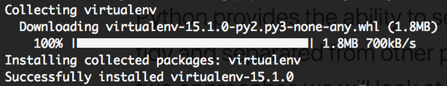
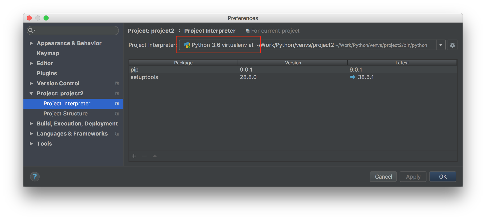
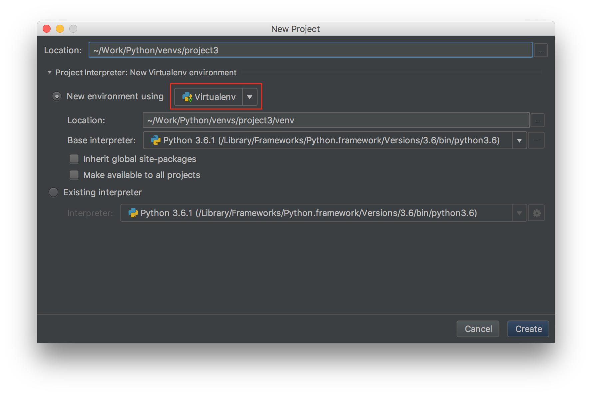



*Virtual environments are a good way to improve flexibility and prevent projects and packages from interfering with each other. Each virtual env is created with it’s own Python binary and set of site packages. This means projects can reference different Python interpreters and installing packages in virtual environments also prevents polluting the global space with unwanted packages. The two approaches we will look at here are the `virtualenv` package and Python 3’s `venv` module.*

## The virtualenv Package
Virtualenv is based on Install `virtualenv` using `pip` (`pip3` assumes you're using `Python3`):
```
pip3 install virtualenv
```

Pip will retrieve and install the package automatically:



With virtualenv installed, creating a new project is simple:
```
mkdir project1
virtualenv project1
```

To create a project using a specific interpreter, use the `-p` flag with virtualenv:
```
virtualenv project1 -p $(which python3)
```

To start the project, `cd` into the project folder and `activate` the environment:
```
cd project1
source bin/activate
```

Once the project is active, the command prompt shows the name of the project in parenthesis:

```
(project1) MacBook:project1 user$ _
```

With the project running, `pip` will install packages locally to the virtual environment. To exit the virtual environment, use `deactivate` at the prompt:

```
(project1) MacBook:project1 user$ deactivate
```

To remove the project, just delete the `project1` folder.

## Python's venv Module
Python also has the `venv` module. To create a new project named `project2` in the current directory:
```
python3 -m venv project2
```

This will create a new virtual environment in the `project2` folder. As with `virtualenv`, `cd` into the `project2` folder and manage the environment with the `activate` and `deactivate` commands:
```
MacBook:virtual-envs user$ cd project2
MacBook:project2 user$ source bin/activate
...
(project2) MacBook:project2 user$ deactivate
MacBook:project2 user$ _
```

## PyCharm Supports Virtual Environments
`PyCharm` supports working with existing virtual environments as well as creating new projects using `virtualenv`:


